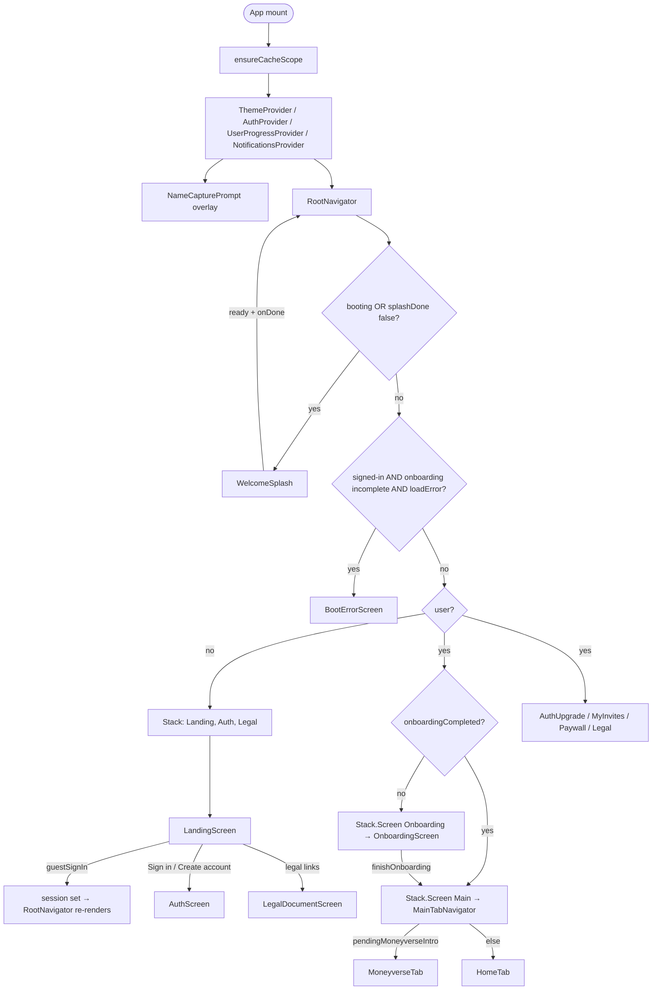
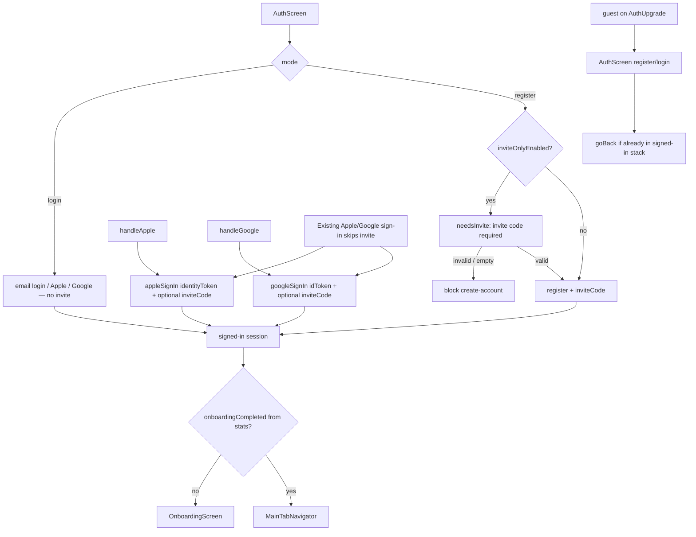
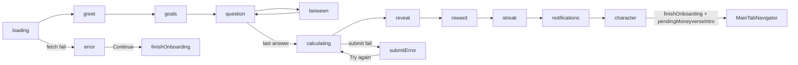
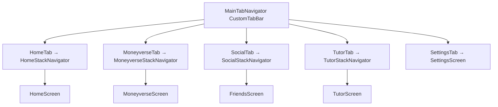
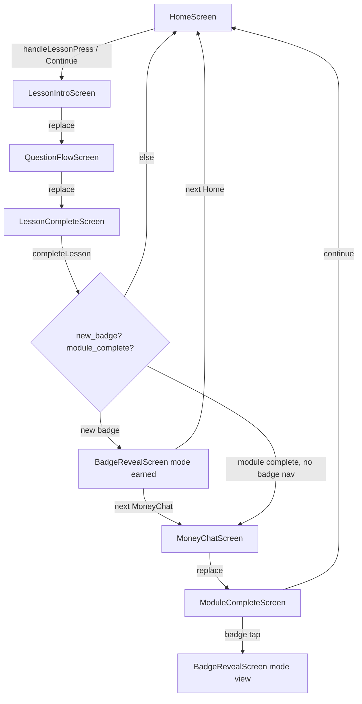
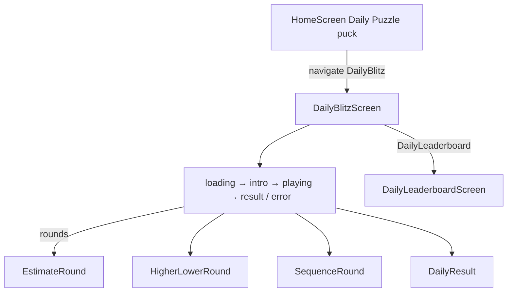
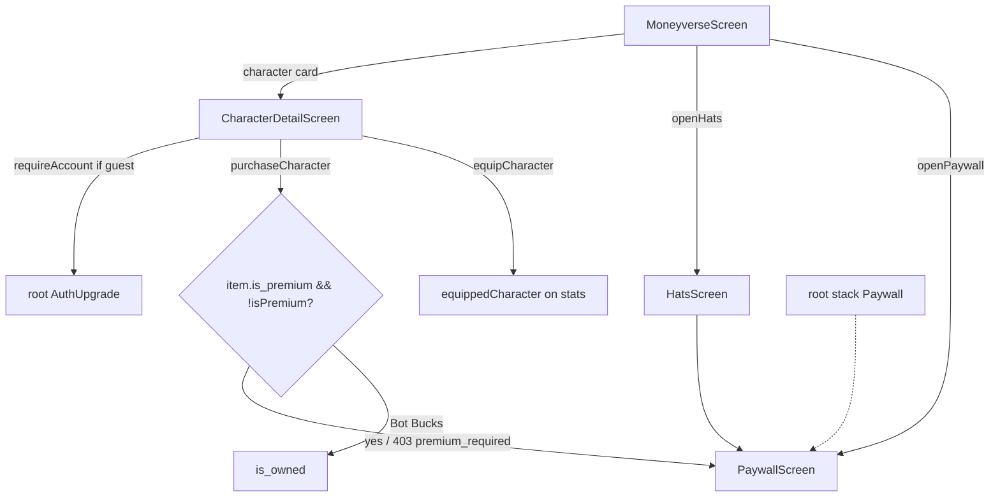
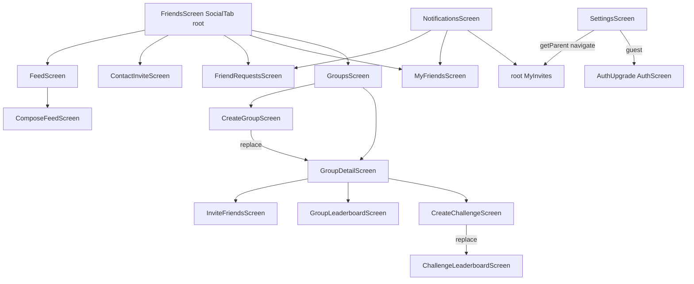
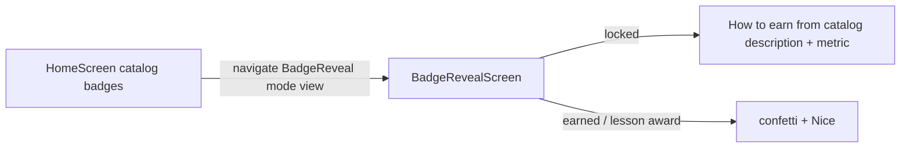

# MoneyBot mobile app flowchart

Real navigation as of the Expo app in `mobile/`. Names match screen and component identifiers in `mobile/App.js` and `mobile/src/navigation/MainTabNavigator.js`.

## 1. Cold start → splash → auth / guest → onboarding → tabs

`NameCapturePrompt` is not a stack route. It is a modal over the tree after onboarding when `user.name` is blank.

## 2. Invite-only signup vs returning Apple / Google

## 3. Onboarding phases

Phases live in `OnboardingScreen`. Empty quiz catalog skips `question` and submits from `goals`.

## 4. Main tabs

`LESSON_ROUTES` in `MainTabNavigator` hides `CustomTabBar` on lesson, daily, arcade, social nested, feed compose, and Paywall screens.

## 5. Lesson completion path

Registered on `HomeStackNavigator` with those names: `LessonIntro`, `QuestionFlow`, `LessonComplete`, `MoneyChat`, `ModuleComplete`, `BadgeReveal`.

## 6. Daily puzzle

Tab bar is hidden while `DailyBlitz` / `DailyLeaderboard` is focused.

## 7. Moneyverse purchase / equip + paywall

`Paywall` is registered on the root stack (`App.js`), `HomeStackNavigator`, and `MoneyverseStackNavigator`. `openPaywall(navigation)` walks parents until it finds a `Paywall` route. Purchase CTA on `PaywallScreen` is a stub (no RevenueCat).

## 8. Social, invites, feed

`MyInvitesScreen` is a **root** stack screen (`App.js`), not inside `SocialStackNavigator`. Group invites use `InviteFriendsScreen` on the social stack.

## 9. Home stack extras

`HomeStackNavigator` also registers (even if Home does not always deep-link them): `Leaderboard`, `Arcade`, `BudgetBlitz`, `InflationDodge`, `CreditClimb`, `ScamSpotter`, `DailyBlitz`, `DailyLeaderboard`, `BadgeReveal`, `Paywall`.

Arcade games are nested under `Arcade` / the named game screens on the Home stack. Tutor is `TutorStackNavigator` → `TutorScreen` only.

## 10. Badge preview

Locked Home chips already navigate to `BadgeReveal`. Earn rules come from `badgeCatalog` (`description`, `metric`, `threshold`, `module_id`). Backend evaluators include `hats_owned` and `friends_count`. A `module_completed` badge with no `module_id` cannot be earned until admin assigns a module.
